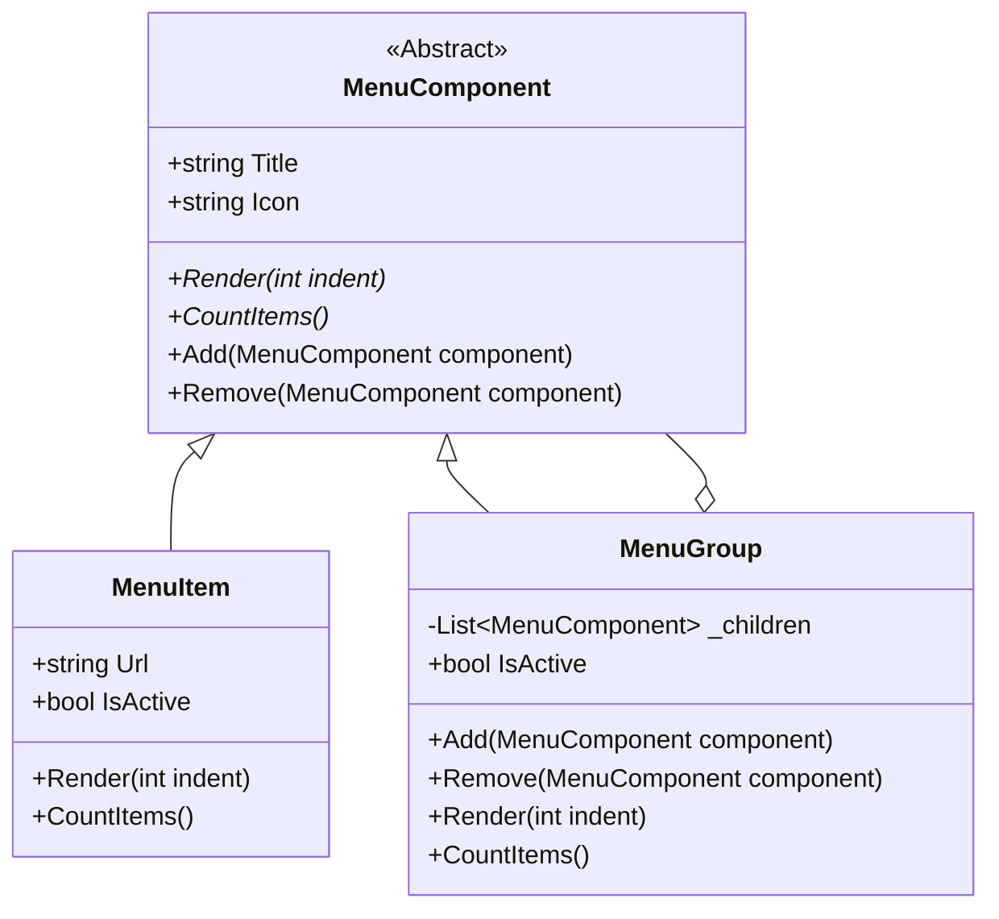

## 🥁 CarnaCode 2026 - Desafio 08 - Composite

Oi, eu sou o Ronaldo e este é o espaço onde compartilho minha jornada de aprendizado durante o desafio **CarnaCode 2026**, realizado pelo [balta.io](https://balta.io). 👻

Aqui você vai encontrar projetos, exercícios e códigos que estou desenvolvendo durante o desafio. O objetivo é colocar a mão na massa, testar ideias e registrar minha evolução no mundo da tecnologia.

### Sobre este desafio
No desafio **Composite** eu tive que resolver um problema real implementando o **Design Pattern** em questão.
Neste processo eu aprendi:
* ✅ Boas Práticas de Software
* ✅ Código Limpo
* ✅ SOLID
* ✅ Design Patterns (Padrões de Projeto)

## Problema
Um sistema de gestão de conteúdo precisa construir menus com itens simples e submenus aninhados.
O código atual trata itens individuais e grupos de forma diferente, complicando operações recursivas.

## Solução com Composite Pattern

O padrão **Composite** permite compor objetos em estruturas de árvore para representar hierarquias partes-todo. O Composite permite que os clientes tratem objetos individuais e composições de objetos de maneira uniforme.

### Diagrama de Classes



### Estrutura do Projeto

```
src/
├── Composite/
│   ├── MenuComponent.cs  # Classe base abstrata
│   ├── MenuGroup.cs      # Implementação do Composite (com filhos)
│   └── MenuItem.cs       # Implementação do Leaf (sem filhos)
├── Challenge.cs          # Código original (Legado)
├── DesignPatternChallenge.csproj
└── Program.cs            # Novo ponto de entrada (executa ambas as versões)
```

### Etapas da Refatoração

1.  **Criação do Projeto**: Adicionado arquivo `.csproj` para gerenciar dependências e build.
2.  **Definição do Componente**: Criação da classe abstrata `MenuComponent` em `src/Composite`, definindo a interface comum (`Render`, `CountItems`, `Add`, `Remove`).
3.  **Implementação do Leaf**: Criação da classe `MenuItem` herdando de `MenuComponent`, representando os itens individuais do menu.
4.  **Implementação do Composite**: Criação da classe `MenuGroup` herdando de `MenuComponent`. Esta classe mantém uma lista de filhos (`_children`) e implementa as operações recursivamente (ex: `Render` chama `Render` de cada filho).
5.  **Adaptação do Código Legado**: Pequeno ajuste em `Challenge.cs` para permitir que o `LegacyProgram` fosse executado a partir do novo ponto de entrada.
6.  **Novo Entry Point**: Criação de `Program.cs` que oferece um menu interativo para executar tanto a solução original quanto a nova solução com Composite, demonstrando a equivalência funcional e a melhoria estrutural.

## Como Executar

Para executar o projeto e comparar as soluções:

```bash
cd src
dotnet run
```

Escolha a opção `1` para ver a implementação original ou `2` para ver a implementação com Composite Pattern.

## Sobre o CarnaCode 2026
O desafio **CarnaCode 2026** consiste em implementar todos os 23 padrões de projeto (Design Patterns) em cenários reais. Durante os 23 desafios desta jornada, os participantes são submetidos ao aprendizado e prática na idetinficação de códigos não escaláveis e na solução de problemas utilizando padrões de mercado.

### eBook - Fundamentos dos Design Patterns
Minha principal fonte de conhecimento durante o desafio foi o eBook gratuito [Fundamentos dos Design Patterns](https://lp.balta.io/ebook-fundamentos-design-patterns).

### Veja meu progresso no desafio
[Repositório Central](https://github.com/ronaldofas/balta-desafio-carnacode-2026-central)
